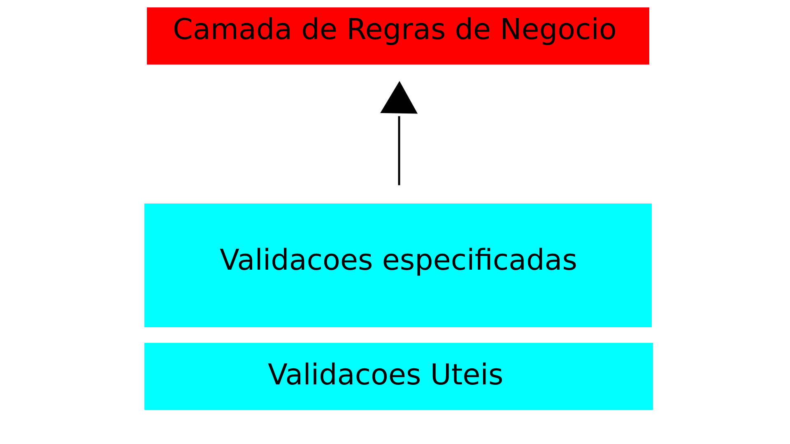

# Treinamento-Java

## Descricao
Projeto desenvolvido para aprendizado e aplicacao dos conceitos de Arquitetura em Camadas e TDD (Test Driven Development).

#
## Stack

### IDE
 Eclipse

### Framework
 JUnit

### Gerenciador de dependencias
 Maven

### Linguagem de Programacao
 Java

#
## Schema de validacao
As validacoes aplicadas sob as classes de dominio (model) estao de acordo com o seguinte schema.

     
    figura 1 - schema de validacoes.

- Validacoes Uteis: metodos generalizados para validacoes de um unico aspecto do dado fornecido, como exemplo a validacao da quantidade de caracteres em um dado fornecido.

- Validacoes especificadas: implementam as validacoes uteis para construir validacoes especializadas, exemplo para a validacao de cpf e necessario utilizar as seguintes validacoes genericas: validar se o dado nao e nulo, quantidade de caracteres, aplicar o algoritimo de modulo 11. deste modo a validacao especializada para cpf e construida a partir das validacoes genericas.

